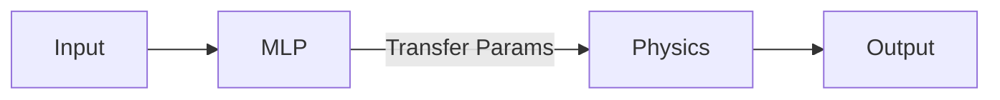

# ADAMS Lab: Hybrid Python Machine Learning Library (HyPyML) Documentation:
The following document describes usage of the HyPyML python library.


## To Do:
### Features
- [ ] Add ability to input custom PyTorch nn classes
- [ ] For each module, optionally specify the order of input and output. Default is just serial
### Documentation
- [ ] Add documentation to every class allowing for the future use of sphinx.
- [ ] Update the sample script and example documentation

## Installation
Installing with the built wheel (Pre-built wheel available for Ubuntu 22.04 based distros)
```
pip install dist/hypyml-0.1.x-py3-none-any.whl
```
Building wheel using poetry
 
When installing on a OS other than the one specified above, the wheel can be built using the following command after which the same installation command is to be used.

```
cd HyPyML
poetry build HyPyML
```

## Requirements: 
1. Google JAX (https://github.com/google/jax)
2. PyTorch (https://pytorch.org/)
3. Joblib (https://joblib.readthedocs.io/en/latest/)

## Initializing HyPyML: 

The HyPyMl class needs a list of dicts to intialize the model. An example architecture and it's corresponding input to initialize the OPTMA class is shown below.


```
from hypyml.model import HyPyML
architecture = [dict(Type="MLP",config=dict(D_in=c.D_in , D_out= c.D_PP,Hidden_layer_size= 100, Num_layers= 3),args =None),
                dict(Type="Physics", Forward = c.partial_physics, Jacobian = c.partial_jacobian,args = None)]


model = HyPyML(architecture)
```

The arch list contains as many dictonaries as there are models in the final OPTMA model and in that order.
Each dictonary contains the following entries: 
1. Type : str, with value either "MLP" or "Physics" 
2. config: dict, only required if Type == "MLP". Contains the following entries:

    a. D_in: int, Number of inputs to MLP
    b. D_out: int, Number of outputs of MLP
    c. Hidden_layer_size: int, Number of nodes per hidden layer
    d. Num_layers: int, Number of hidden layers.
3. Forward: function, only required if Type=="Physics".
4. Jacobian: function, only required if Type=="Physics"
5. args: list containing indices of inputs that need to be passed unaltered to the Physics functions. If Type=="MLP" set args==None. 

## Training 
Please refer to the **sample_train.py** file provided.